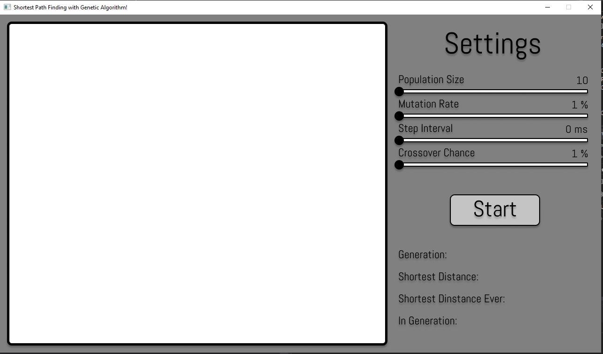
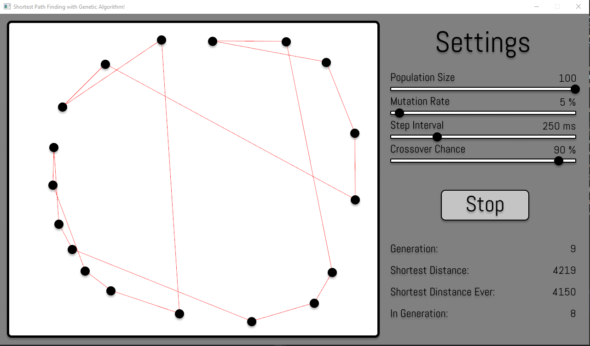
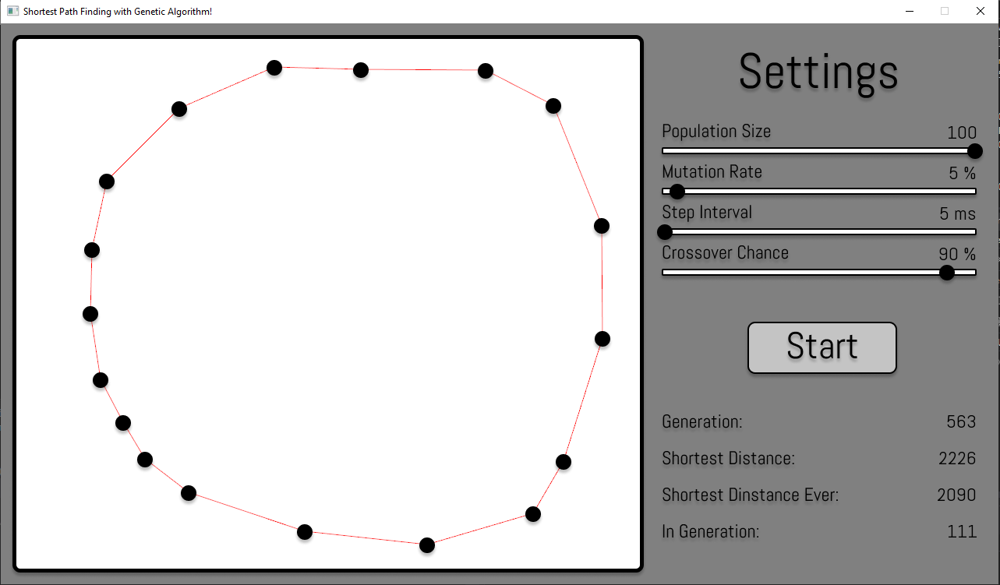

# GeneticAlgorithm
## Finding shortest path with genetic Algorithm.

* You can adjust GA properties by moving sliders.
* You can add nodes by pressing left mouse button.
* You can move nodes by holding left mouse button.
* You can remove Node by clicking right mouse button.

