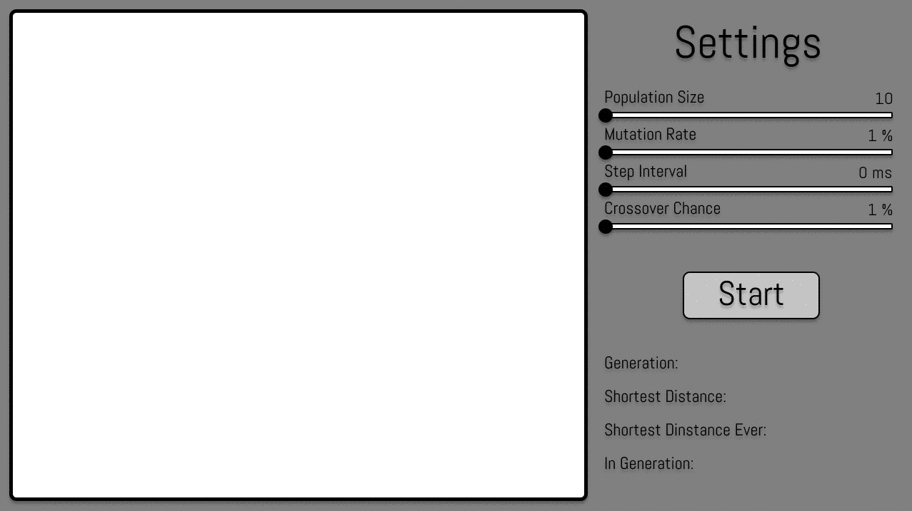

# GeneticAlgorithm
## Finding shortest path with genetic algorithm.

* You can adjust GA properties by moving sliders.
* You can add nodes by pressing left mouse button.
* You can move nodes by holding left mouse button.
* You can remove node by clicking right mouse button.
## Compiled on Windows 10 by Visual Studio 2017 with SFML library